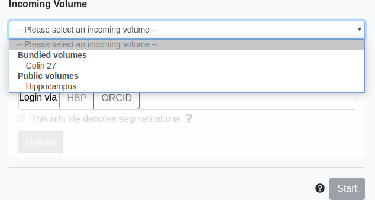
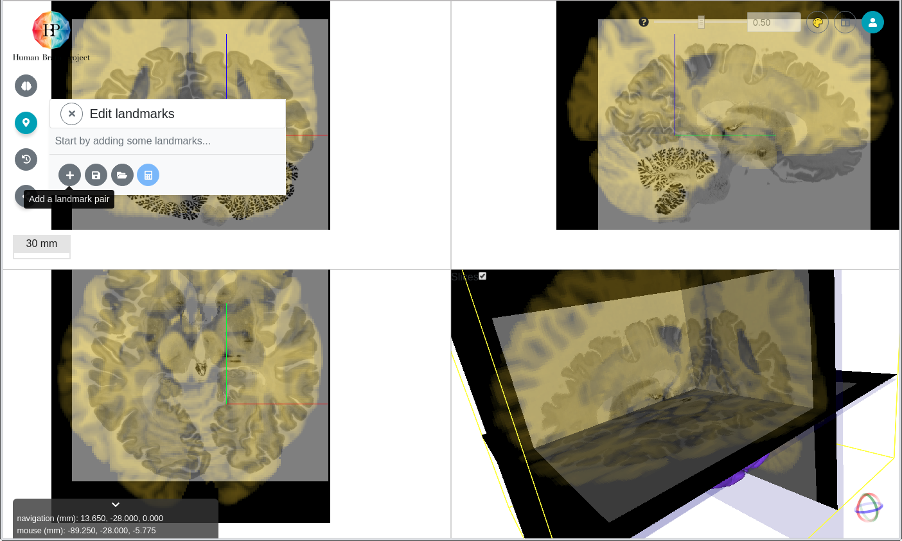
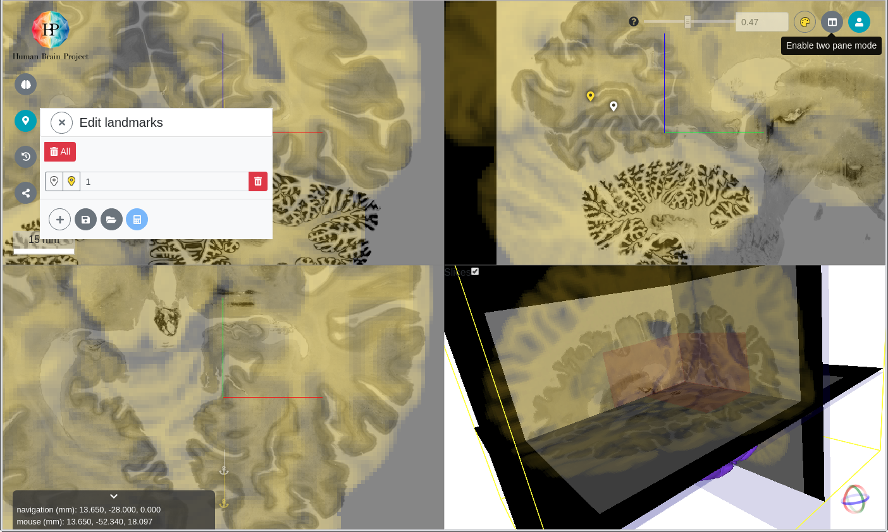
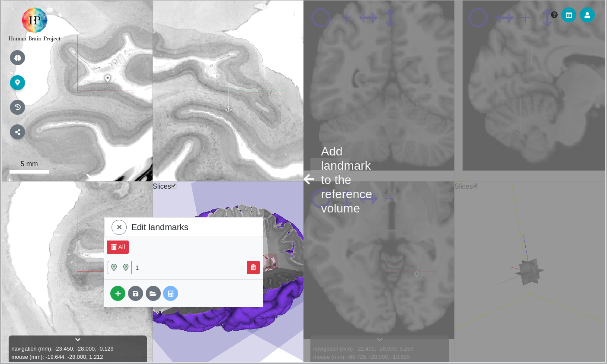
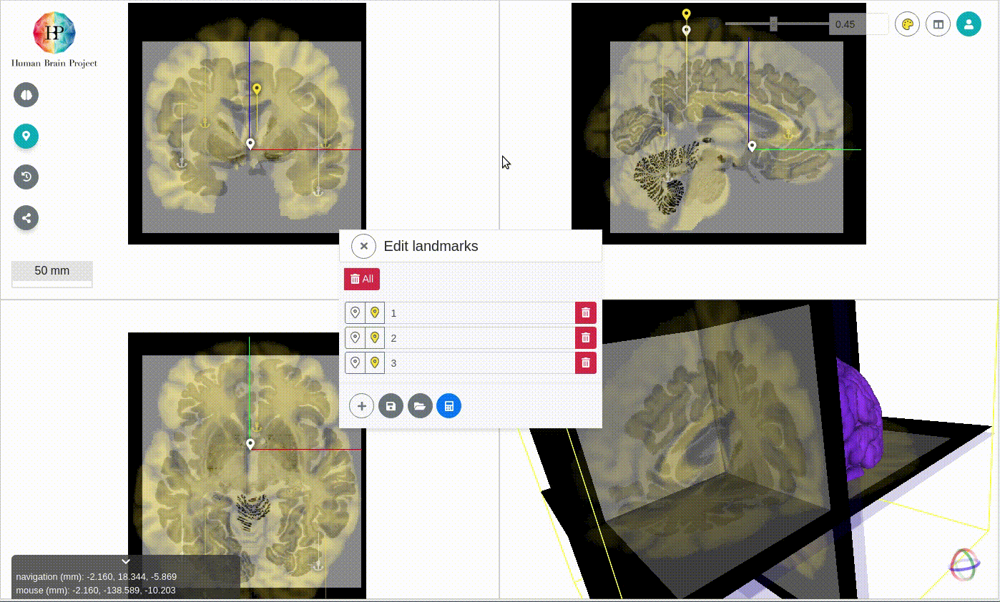

# Voluba

volumetric brain anchoring

## Useful info

- report a bug: <inm1-bda@fz-juelich.de>
- production instance: <https://voluba.apps.hbp.eu>
- develop instance: <https://voluba-next.apps-dev.hbp.eu>

## Before starting

You will need an [ORCID](https://orcid.org/) or [HBP OIDC](https://wiki.humanbrainproject.eu) account if you would like to upload and anchor your own nifti volume.

## Getting started

- navigate to <https://voluba.apps.hbp.eu> or <https://voluba-next.apps-dev.hbp.eu>

  

- Either:
  - Selected a public volume

    

  - Upload and/or select a private volume
    - Login with ORCID or HBP OIDCv2
    - Either:
      - Select a private volume
        
      - Upload a private volume

- Click **Start** to start the volumetric anchoring workflow

## Coarse alignment (Optional)

- Click-Drag incoming volume to approximate location
  

## Fine aligment

Fine alignment can be achieved by adding corresponding landmarks on incoming and reference landmarks. 

### Overlay mode

- Open **Edit landmarks** menu
  

- Use **Add a landmark pair** button to add landmark in reference volume first, then incoming volume
  

### Parallel mode

Parallel mode can be toggled via the **two panel mode** button on top right corner.

Adding landmark in reference template

Adding landmark in incoming volume

## Calculate linear transformation

When three or more landmark pairs have been added **Compute and display transform based on landmarks** Computes the linear transformation of volume and applies it to the incoming volume

