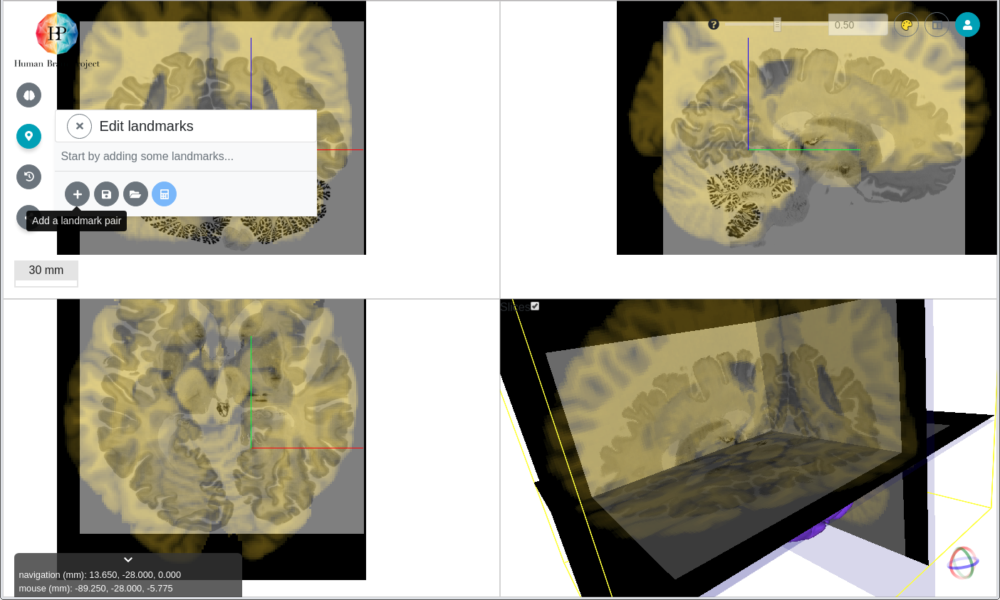
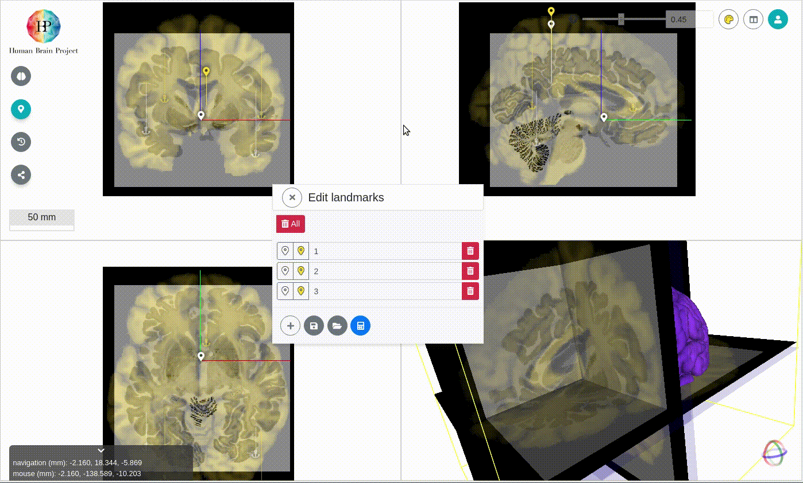

# Aligning the input dataset to the reference volume 

## Adjusting the initial 3D position

You can `drag` incoming volume to the approximate location of the reference template.

## Refining the alignment with pairs of corresponding 3D landmarks

!!! hint
    Toggle on to enable a most distraction free fine alignment workflow.

You can refine the linear alignment by adding corresponding landmarks on both the incoming volume and in the reference space.

- Open **Edit Landmarks** menu

- Use **Add a landmark pair** button to add landmark in reference volume first, then incoming volume

## Calculate linear transformation

When three or more landmark pairs have been added **Compute and display transform based on landmarks** Computes the linear transformation of volume and applies it to the incoming volume

The linear transformation is calculated by <https://github.com/HumanBrainProject/voluba-linear-backend> deployed on ebrains infrastructure.

