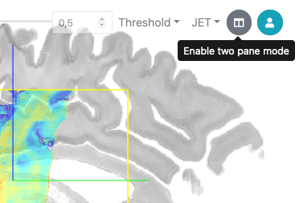
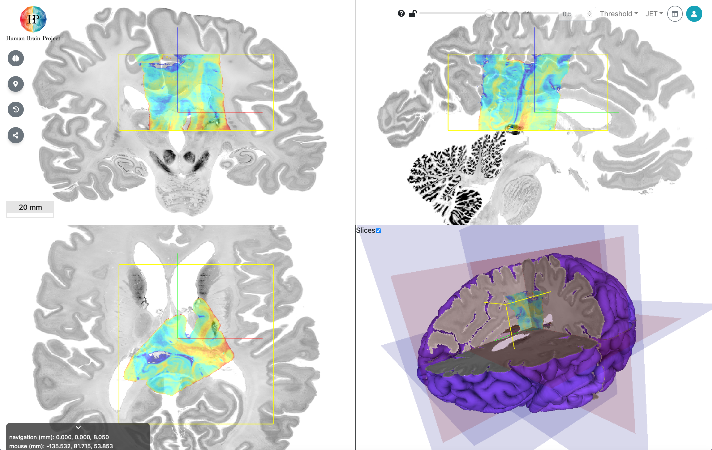
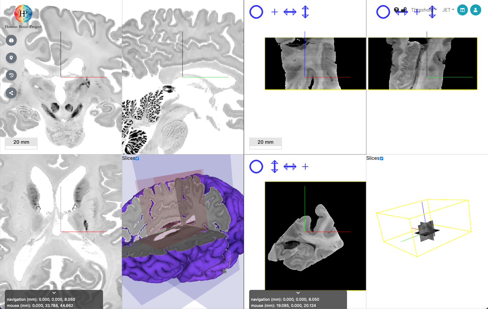
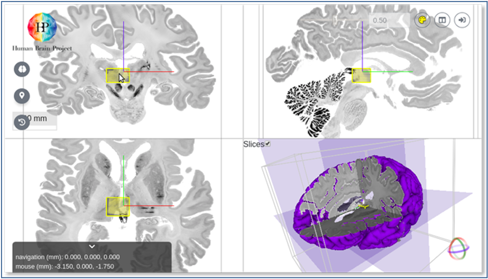
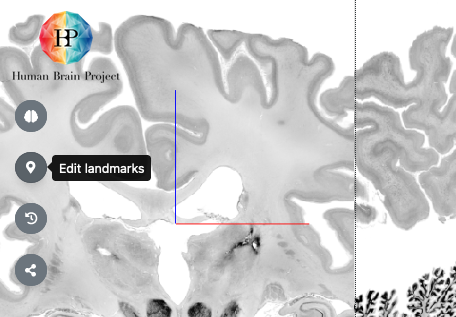
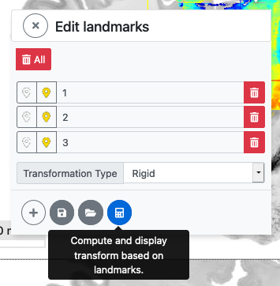
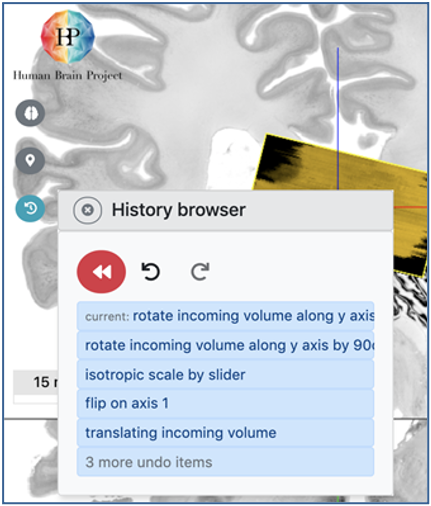

# Aligning the input dataset to the reference volume 

Anchoring an input image to the reference volume in VoluBA is typically performed in the following order:

 1. Initial adjustment of coordinate axes orientations and scalings to match the target space
 2. Interactive translation and rotation of the incoming data volume to set the position and 3D orientation (leading to a 3D similarity transformation)
 3. Refinement of the initial alignment by entering additional corresponding pairs of anatomical landmarks  (leading to a 3D affine transformation)

These steps can be performed and repeated in arbitrary order and are supported through a history browser, which allows to undo actions and roll back to any previous status of alignment. 

## Understanding the overlay and side-by-side modes

At any time, the visual interface can be used in two different modes, by clicking the “mode” button in the upper right part user interface:

The default mode is “overlay”, which displays the input and reference volumes superimposed, and allows to adjust colormap and transparency of the input dataset. 

The second is “side-by-side mode”, which shows the two volumes in separate panels. 

!!! Info
	All actions can be performed in both modes, although for some actions it is advisable to use a specific mode. For example, adding corresponding landmarks is typically more intuitive in the side-by-side mode, while interactive shifting of the incoming volume is more easily performed in the overlay mode.

## Initial alignment with direct manipulation 

After upload and selection of an incoming data volume, VoluBA starts in overlay mode. 
Here it allows direct manipulation of the input data position and orientation using the mouse pointer. 
The position is changed by clicking & dragging the incoming volume in any of the orthogonal views. 
By pressing shift while clicking & dragging, a rotation is applied. 

The orientation and scaling of the coordinate axes of the input data can be changed modified using the “Transform” dialog box,
which also allows precise adjustment of position and orientation. 
The dialog is launched using the button with the brain icon on the left of the user interface:

## Refined alignment with 3D landmarks

Once an acceptable alignment has been achieved based on the rigid transformations described above, you can start entering anatomical landmark pairs in either overlay or side-by-side mode to compute an affine refinement of the image transformation.

!!! hint
    Entering landmarks is usually more intuitive to perfom in side-by-side mode.

To enter landmarks, select the **Edit Landmarks** menu from the left side of the user interface.

In side-by-side mode, you are asked to first select a 3d point in the reference volume, then the corresponding point in the input dataset:

In overlay mode, you enter two landmarks sequentially in the same window. They are distinguished by their colors:

Each landmark can be given a name, and the list of landmarks can be downloaded as a json file for reference and reuse. 

Entering landmarks does not immediately influence the position of the incoming volume. You need to explicitely request to compute the refined transformation:

Just as the previous adjustments of position, scale, rotation or axis orientation, the application of the affine transformation will be recorded in the history browser and can be reverted. 

!!! Hint
	The initial rigid transformations (direct adjustment of position and orientation) have no influence on the computation of the refined affine transformation. 
	The affine transformation estimation depends exclusively on the landmark pairs. 
	Hence, when using landmark-based alignment, the initial alignment is only used to provide a better visual orientation for entering landmarks.

## Inspecting and undoing alignment steps

VoluBA tracks every step that you execute during the alignment process. 
This includes translations, axis flips, rotations, scalings, and application of affine matrices that have been estimated from landmark pairs. 
You can inspect and navigate the process using the history browser, which is accessible via the "rollback" button on the left: 

The history is implemented as a stack, from which the top element can be removed at any time, resulting in a rollback to the previous version of the alignment. 
As long as no new action is applied to a recovered version of the history, the “undo” actions can be recalled again (“redo”). 
This allows you to conveniently navigate forward and backward your image alignment process.

