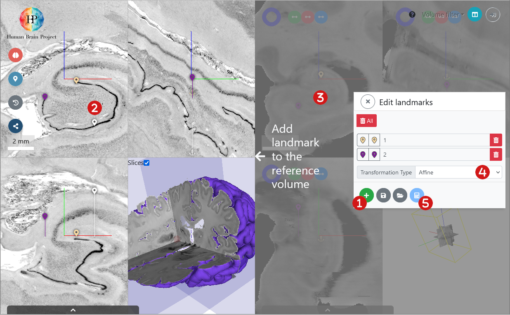

# Transforming the input volume 

After preparing the incoming volume, you can now align it to the selected target space. 
Anchoring an input image to the reference volume in voluba is typically performed in the following order:

1. [Initial adjustment of coordinate axes orientations and scaling](#initial-adjustment-of-coordinate-axes-orientations-and-scaling) to match the target space
2. [Interactive translation and rotation](#interactive-translation-and-rotation) of the incoming data volume to set the position and 3D orientation
3. [Refinement](#refined-alignment-with-3d-landmarks) of the initial alignment by entering additional corresponding pairs of anatomical landmarks

These steps can be performed and repeated in arbitrary order and are supported through a [history browser](#inspecting-and-undoing-alignment-steps), which allows to undo actions and roll back to any previous status of alignment.

## Initial adjustment of coordinate axes orientations and scaling

The axis orientations and the voxel scaling can be modified using the **Transform incoming volume** dialog box, which also allows precise adjustment of position and rotation. The dialog is launched using the button with the brain icon on the left of the user interface:

If you didn't specify the voxel resolution in your NIfTI header, voluba assumes 1 mm voxel resolution. In this case, you need to manually specify the actual resolution in the **Resolution** section. As the resolution and the scale are related to each other, the values change when either one is modified. This means you can also influence the resolution by scaling the volume. You can adjust the scale for all axes or for each axis separately by ticking off `Isotropic`.

Whenever you want to secure a transformation parameter, click on the lock. This locks the value so that it cannot be changed, for example by interactive manipulation. You can also fix all settings by clicking the lock on the top right next to the volume filters. It is useful to prevent you from accidentally changing the transformation parameters when inspecting the alignment.

## Interactive translation and rotation

As mentioned above you can adjust the incoming volume's position and orientation by entering values into the **Transform incoming volume** dialog. Additionally, voluba allows direct manipulation of the input data's position and orientation using the mouse pointer. The position is changed by clicking & dragging the incoming volume in any of the orthogonal views. 
By pressing shift while clicking & dragging, a rotation is applied. 

## Refined alignment with 3D landmarks

Once an reasonable alignment has been achieved based on the 3D rigid transformations described above, you can start entering pairs of anatomical landmarks in either overlay or two pane mode to compute an affine refinement of the image transformation.

!!! tip
    Entering landmarks is usually more intuitive to perform in two pane mode.

To enter landmarks, select the **Edit landmarks** menu from the left side of the user interface. Click the plus to add a new pair of landmarks. In two pane mode, you are asked to first select a 3D point in the reference volume on the left, then the corresponding point in the input dataset on the right. Delete a single or all landmarks via the corresponding red trash button. Each landmark can be given a name, and the list of landmarks can be downloaded as a JSON file for reference and reuse. Thus, an existing list of landmarks can be loaded from your computer. 

Entering landmarks does not immediately influence the position of the incoming volume. You need to explicitly request to compute the refined transformation.
First, you need to select the type of transformation:

| type                          | translation | rotation   | reflection | scale      | shear           |
|-------------------------------|-------------|------------|------------|------------|-----------------|
| Rigid                         | ✔️ | ✔️ | 			|		     |                 |
| Rigid (allow reflection)      | ✔️ | ✔️ | ✔️ |            |                 |
| Similarity                    | ✔️ | ✔️ |			| ✔️ |                 |
| Similarity (allow reflection) | ✔️ | ✔️ | ✔️ | ✔️ |                 |
| Affine                        | ✔️ | ✔️ | ✔️ | ✔️ | ✔️      |

From a set of landmarks, the affine transformation matrix can be recalculated. Click the blue calculator button to compute and display the transform based on the landmarks. Just as the previous adjustments of position, scale, rotation or axis orientation, the application of the affine transformation will be recorded in the history browser and can be reverted. 

!!! info
	The initial rigid transformations (direct adjustment of position and orientation) have no influence on the computation of the refined affine transformation. 
	The affine transformation estimation depends exclusively on the landmark pairs. 
	Hence, when using landmark-based alignment, the initial alignment is only used to provide a better visual orientation for entering landmarks.

In overlay mode, you enter two landmarks sequentially in the same window. They are distinguished by their colors: white pins mark the position in reference space and yellow pins indicate the location in the incoming volume:

## Inspecting and undoing alignment steps

voluba tracks every step that you execute during the alignment process. 
This includes translations, axis flips, rotations, scaling, and application of affine matrices that have been estimated from landmark pairs. 
You can inspect and navigate the process using the history browser, which is accessible via the **History browser** button on the left: 

The history is implemented as a stack, from which the top element can be removed at any time, resulting in a rollback to the previous version of the alignment. 
As long as no new action is applied to a recovered version of the history, the **undo** actions can be recalled again (**redo**). 
This allows you to conveniently navigate forward and backward your image alignment process.

