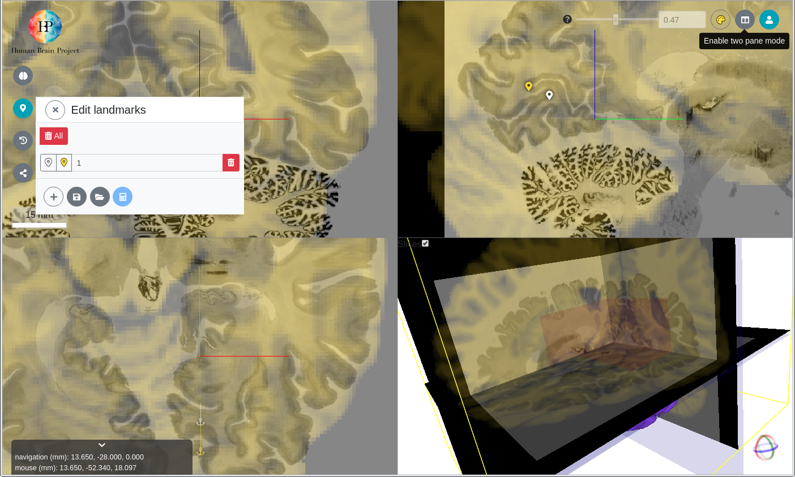
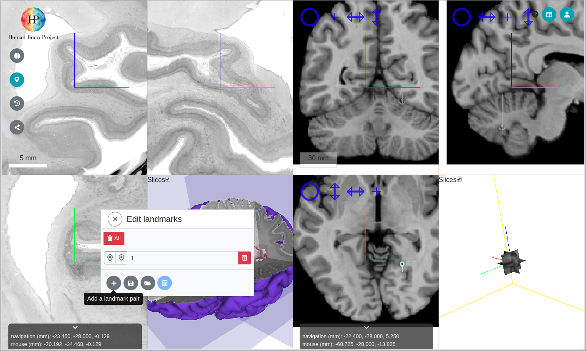

# Parallel mode

In addition to the default overlay mode, user may toggle to a parallel mode.

| overlay mode _(default)_ | parallel mode |
| --- | --- |
|  |  |

Parallel mode allows reference volume and incoming volume to be explore independently of each other, clearer workflow adding landmarks during [Fine alignment](../workflow/fine.md), but loses the ability to carry out [Coarse alignment](../workflow/coarse.md).