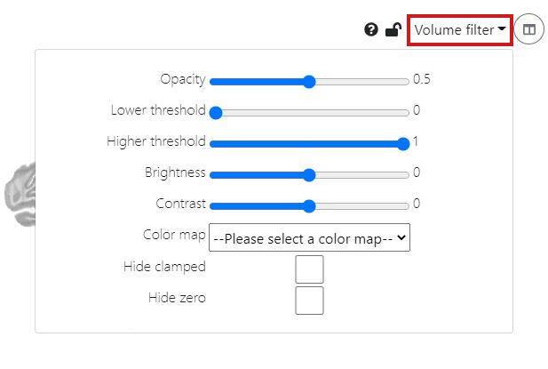
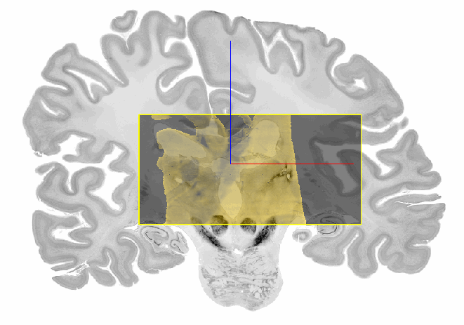
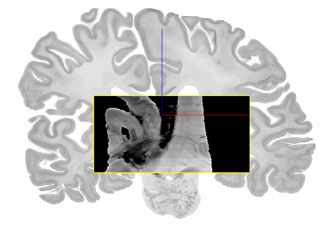
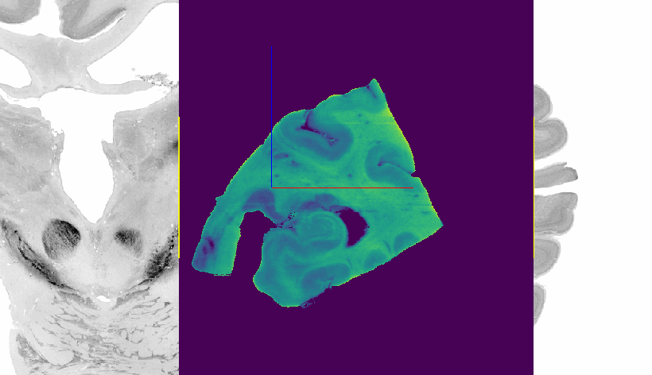

# Filtering the input volume

With the help of `Volume filters` you can configure the presentation of the incoming volume in overlay mode. On the one hand, adjusting the appearance of the input facilitates the distinction between the incoming and the reference volume. On the other hand it is also useful for revealing significant structures that are important features for alignment. You can choose between the following filters:

* [Opacity](#opacity)
* [Lower & Higher threshold](#lower--higher-threshold)
* [Brightness](#brightness)
* [Contrast](#contrast)
* [Color map](#color-map)
* [Hide clamped](#hide-clamped)
* [Hide zero](#hide-zero)

## Opacity

Depending on the alignment step, consider adjusting the opacity. At first, you may want to examine the incoming
volume to reveal significant structures. These can help you find the right orientation and position in target space. Choosing a 
high opacity is useful in this stage of alignment. When doing a finer alignment you may want to have the
reference template slightly visible in the background to match structures of the incoming volume to structures in the
reference volume. In this case you lower the opacity.

## Lower & Higher threshold

The `Lower threshold` and the `Higher threshold` allow you to adjust the pixel values of the incoming volume to make it easier to analyze. With thresholding you can select areas of interest, while ignoring the parts that you are not concerned with. The lower threshold sets small pixel values to the volume's lowest value whereas the higher threshold sets large pixel values to the volume's highest value. Thus, in the case of a grayscale image volume increasing the lower threshold would make the image darker as more pixels are set to black. On the contrary, decreasing the higher threshold leads to a brighter image because more pixels turn white. Therefore, these two filters are especially useful in combination with `Hide clamped` as you can adjust which pixels will be hidden by varying the thresholds. 

## Brightness

Make the incoming volume brighter or darker by adjusting the brightness. Note, that this modifies all pixel values while thresholding only changes a subset of pixels.

## Contrast

If you have difficulties to distinguish structures in the incoming volume, increase the contrast. 

## Color map

Sometimes a different color map can reveal structures in the incoming volume, that are invisible with the current filter parameters. Try some standard color maps
to achieve a better distinction between parts of the brain tissue. To display the actual colors of your image data, select `rgb (3 channel)`. We
especially recommend this color map for two-photon microscopy data.

## Hide clamped

To hide the background of the incoming volume, tick the `Hide clamped` option. This removes all pixels with the lowest value.

# TODO ask Daviti what Hide zero does (or should do)