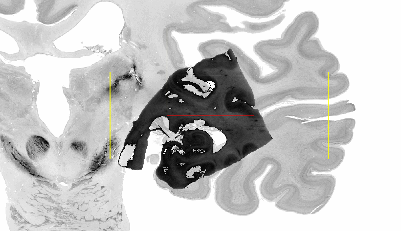

# Filtering the input volume

With the help of `Volume filters` you can adjust the appearance of the incoming volume in overlay mode. This leads to 
better distinction between the displayed structures. You can choose between the following options:

* [Opacity](#opacity)
* [Lower & Higher Threshold](#lower--higher-threshold)
* [Brightness](#brightness)
* [Contrast](#contrast)
* [Color map](#color-map)
* [Hide clamped](#hide-clamped)
* [Hide zero](#hide-zero)

## Opacity

Depending on the alignment step, you should consider adjusting the opacity. At first, you may want to examine the incoming
volume to find significant structures. These can help you find the right orientation and position in space. Choosing a 
high opacity is useful in this stage of alignment. When doing a finer alignment you may want to have the
reference volume slightly visible in the background to match structures of the incoming volume to structures in the
reference volume. In this case we recommend a lower opacity.

# TODO better: show example where adjustment makes sense --> it doesn't matter which value range is available but rather
# when and why to use it
# lower/higher threshold: hide everything besides special structure
# brightness: Hippocampus dunkler einstellen als eigentlich ist --> brigter machen
# contrast: Hippocampus mit weniger Kontrast einstellen als eigentlich ist --> höheren Kontrast machen
# colormap: Hippocampus von grey auf jet --> bessere distinction?
# hide clamped: lassen
# hide zero: what even is this?

## Lower & Higher Threshold

Define which colors belong to background (lower threshold) and foreground (higher threshold)

## Brightness

Make the incoming volume brighter or darker by adjusting the `Brightness`.

## Contrast

Increase the contrast if you have difficulties to distinguish structures in the incoming volume.

## Color map

Sometimes a different color map can reveal hidden structures in the incoming volume. Try some standard color maps
to achieve a better distinction between regions. Display the true colors of your image data with `rgb (3 channel)`. We
especially recommend this color map for Two-Photon-Microscopy data.

## Hide clamped

To hide the background of the incoming volume, tick the `Hide clamped` option.

## Hide zero