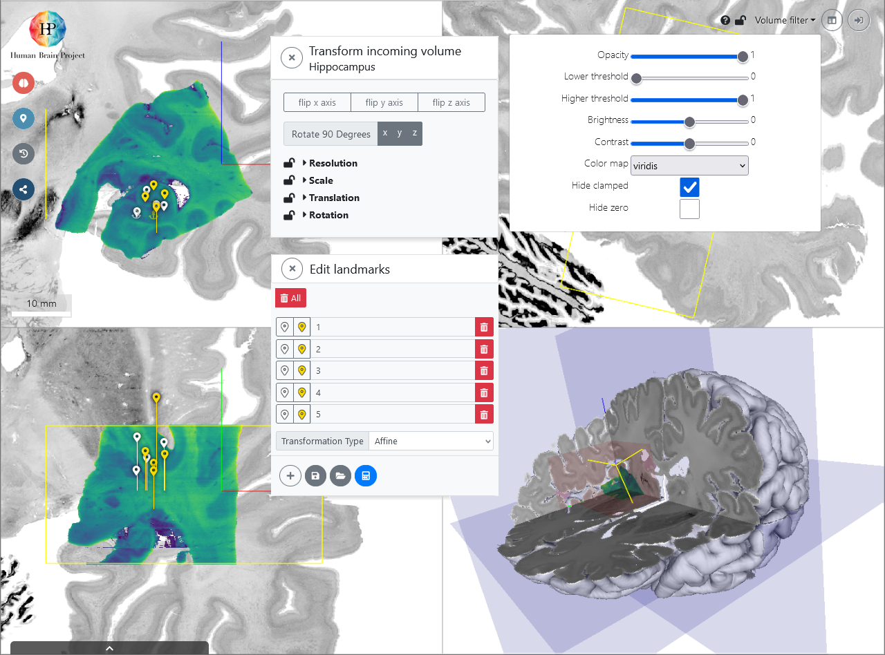

# About voluba

"voluba" is an acronym for **Volu**metric **B**rain **A**nchoring. 
It is a browser based tool for interactive alignment of volumes of interest from brain imaging experiments with a high-resolution 3D reference brain model.

Spatial anchoring of high-resolution volumes of interest (VOIs) from specific imaging experiments into the detailed anatomical context of a high-resolution reference model like [BigBrain](https://search.kg.ebrains.eu/instances/Dataset/d07f9305-1e75-4548-a348-b155fb323d31) is a practical problem due to the size of many high-resolution volumes (BigBrain is one Terabyte of data!), and the lack of automatic methods for image alignment with partial volumetric datasets.
The main idea behind voluba is to allow interactive alignment to microscopic resolution 3D image volumes without downloading them to a local computer.
Instead, voluba allows to upload your own volume of interest - which is typically significantly smaller - to a private space on the server, perform the interactive image alignment in your web browser, and retrieve the resulting parameters of the spatial alignment. The dataset will be linked to your ORCID id and not be shared or exposed to anybody else.

voluba offers a highly interactive workflow. 
First, you log in with your ORCID or EBRAINS account to upload a dataset into your private working space for the anchoring process. 
You can choose three different reference volumes: the microscopic resolution human brain model ["BigBrain"](https://search.kg.ebrains.eu/instances/Dataset/d07f9305-1e75-4548-a348-b155fb323d31), the Waxholm space template of the Sprague Dawley rat, and the Allen mouse brain.
The input volume is presented as a graphical overlay in a 3D view with orthogonal cross sections, and you can optimize the visualization by customizing contrast, brightness, colormaps, and intensity thresholds. 
You can then directly manipulate the relative position and orientation of the input volume with your mouse point, and adjust of voxel scaling and axis orientations to obtain a rigid transformation. 
Then, you can use voluba's 3D landmark editor to refine the transformation by specifying pairs of corresponding points between the volumes, further facilitated by an optional side-by-side view. 
The landmarks enable a recalculation of the linear transformation matrix with additional degrees of freedom, including shearing. 
Alignment actions can be performed and repeated in arbitrary order, supported through a history browser which allows to undo individual anchoring steps. 

You can download the resulting transformation parameters in json format or export your uploaded image data to NIfTI format with an updated affine. Furthermore, the aligned image can be opened in the atlas viewer [siibra-explorer](https://atlases.ebrains.eu/viewer/go/bigbrain) to see it in the anatomical context of the [EBRAINS human brain atlas](https//ebrains.eu/services/atlases). To share your anchored image with colleagues, you can also obtain a private URL. If you would like to publish the transformation parameters of the anchored result to EBRAINS, voluba offers an automatic workflow for submission.

voluba uses [Vue](https://vuejs.org) for the reactive UI layer, [Vuex](https://vuex.vuejs.org/) for state management, and [Bootstrap 4](https://getbootstrap.com/docs/4.0) for layout.

!!! Info
	Visit our [developer documentation](https://voluba-user-doc.apps-dev.hbp.eu/) for more detailed information about the technical aspects of voluba.