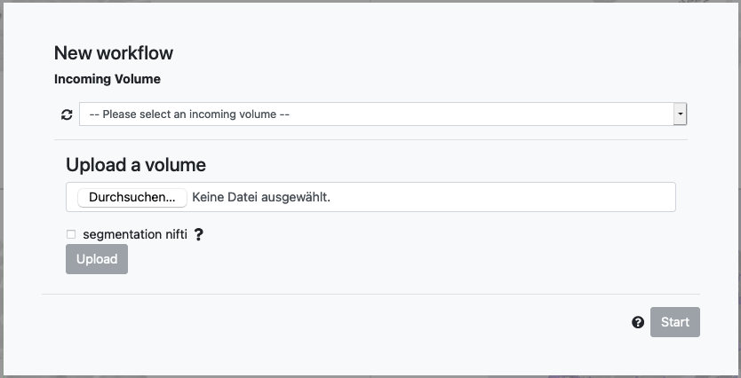

# Setting up the input data

To support large datasets, VoluBA visualizes images from multi-resolution chunks. 
This means that it will not interpret your image files right away, but needs to make them accessible over an http interface that support multi-resolution chunks.

The default installation of VoluBA at <https://voluba.apps.hbp.eu> hosts its reference volumes in a specifically converted [precomputed format](https://github.com/google/neuroglancer/tree/master/src/neuroglancer/datasource/precomputed) on a public webserver.
For the input datasets, it relies on a dedicated *image service* hosted for the [EBRAINS](https://ebrains.eu) infrastructure by [Forschungszentrum Jülich](https://fz-juelich.de).
This image service provides a selection of example datasets and allows you to upload images in NiFTI format for use in VoluBA. 

!!! info
    You will need to sign in with your ORCID or EBRAINS credentials before you can upload image volumes. Being signed in using an EBRAINS account will furthermore allow VoluBA to remember your work in progress between sessions.

Your data will be stored in a protected, private space. 
It will not be accessible to other users, and can be permanently deleted after the alignment is done.
After upload, the image data will be available for selection under `Private volumes`:

Select a public or uploaded private input image, and click `Start` to proceed to the alignment.
