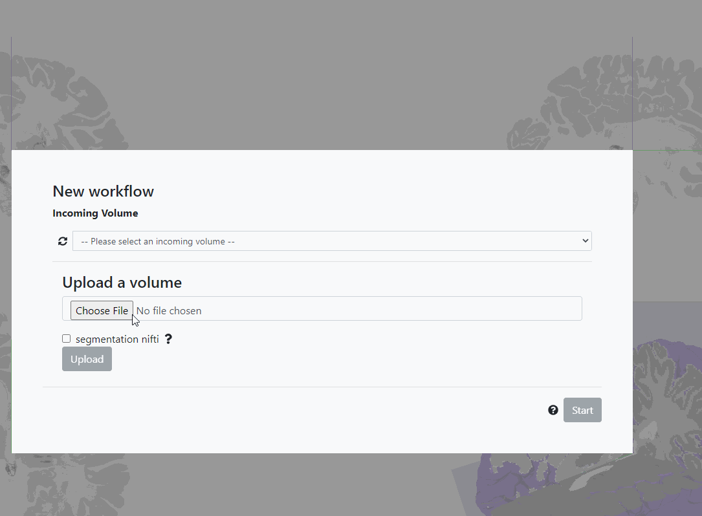

# Loading input data

The first step is to select the incoming volume you want to anchor. VoluBA provides a selection of example datasets
but also allows you to upload your own image data. Select a [public](#public-volumes)
or [uploaded private input image](#private-volumes) and click `Start` to proceed to the alignment.

## Public volumes

Under `Public volumes` you can find a selection of example datasets. We created them for you to easily try out the
features of VoluBA. By following our [Step-by-step tutorial](tutorial.md) you will learn how to successfully anchor our
Hippocampus volume to the BigBrain reference space.

Datasets published in the [EBRAINS Knowledge Graph](https://search.kg.ebrains.eu/) are not part of
the `Public volumes`. To align an image volume of a dataset in reference space, you have to download the volume from the
Knowledge Graph and upload it to VoluBA as a [private volume](#private-volumes).

## Private volumes

For anchoring your own image data you need to upload the volume to VoluBA. It will then be available for selection under
`Private volumes`.

To protect your uploaded data, you have to sign in with your [ORCID](https://orcid.org/)
or [EBRAINS](https://ebrains.eu) account first. The volumes will be stored in a private space that is not accessible to other
users.

!!! tip
    [Register](https://ebrains.eu/register/) for EBRAINS to get access to more tools, services and data for neuroscientists.

After login click on `Choose File` to select the image data you want to upload. VoluBA expects your files to be in NIfTI
format (.nii or .nii.gz). Please convert your data, if it has a different filetype.

!!! help
    Convert your image files to NIfTI with the help of our [HOW TO](nifti_conversion.md).

By clicking on `Upload` your data will be stored in your private space and is available for alignment. If you want to
permanently delete one of the `Private volumes`, select the according image data as incoming volume and click on the red
trash icon.

