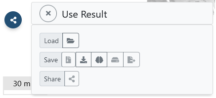

# Using the result

The result of aligning an input image dataset with a reference volume in voluba is the corresponding 4x4 transformation matrix. 
The matrix describes how a point in the coordinate system of the original input dataset should be transformed to match a corresponding point in the reference volume space.

!!! Info
	voluba has used the transformation to display the image volume in superimposition with the reference volume - it did not actually modify the input dataset.

The result can be used in several ways, which are all accessible via the **Use result**  button on the left side of the user interface:



* : In case you uploaded your own image data: Download the image data with an updated NIfTI affine, that includes the applied transformations. 
* /: Export the affine transformation parameters in a simple, plaintext JSON file for sharing and reuse. The stored transformation file can be re-imported in voluba and be utilized in other tools and workflows.
* : Load your input dataset as a semi-transparent overlay in the interactive atlas viewer siibra-explorer, to see it in the comprehensive context of the brain atlas in reference space. This way, you can investigate the aligned image volume relative to all the data that is registered with the corresponding reference atlas.  
* : Publish the transformation parameters of your anchoring result to EBRAINS and optionally connect them to the corresponding EBRAINS dataset.  
* : Generate a private URL to view and share the anchored volume as a remote dataset in neuroglancer-based image viewers.

## Specification of the voluba transformation matrix

In this section you can find a detailed description about the transformation matrix produced by voluba and how you can convert it.
An example transformMatrix.json in voluba looks like this:

```
{
  "incomingVolume": "Hippocampus",
  "referenceVolume": "BigBrain (2015)",
  "version": 1,
  "@type": "https://voluba.apps.hbp.eu/@types/transform",
  "transformMatrixInNm": [
    [
      0.03409423679113388,
      0,
      0,
      11798058
    ],
    [
      0,
      0.007783324457705021,
      -0.04088926315307617,
      5169337.5
    ],
    [
      0,
      0.0331939272582531,
      0.009587729349732399,
      -30914778
    ],
    [
      0,
      0,
      0,
      1
    ]
  ]
}
```

* `incoming volume`: anchored volume
* `reference volume`: reference space that `incoming volume` was anchored to
* `version`: schema version
* `@type`: schema to validate a transformMatrix.json
* `transformMatrixInNm`: $4\times4$ affine matrix, that encodes the transformations in nm, that the user applied to `incoming volume` in voluba

!!! Info
    In the following section the `transformMatrixInNm` will be called _voluba affine matrix_ or `voluba_affine`.

### Relation between the updated NIfTI affine and voluba affine matrix

voluba allows you to download your uploaded volume again with an updated NIfTI affine matrix. This updated NIfTI affine includes the original NIfTI affine (voxel to physical) as well as the transformations applied in voluba (incoming to reference volume). To explain how the updated NIfTI affine is calculated, we need to consider the following:

voluba shows the reference and incoming volume superimposed in physical space. Therefore, both volumes are automatically transformed to physical space using their respective NIfTI affine matrix, when you start a new anchoring workflow. The transformations that you interactively apply afterwards, are encoded in the voluba affine matrix. Keep in mind, that this matrix does **not** include the initially applied NIfTI affine. Also, the voluba affine matrix uses nm as spatial unit. To convert the voluba affine into a NIfTI compatible affine, we need to apply the following conversion:

```python
# voluba to affine of different format
for n in range(3):
  converted_voluba_affine[n][n] = voluba_affine[n][n] * voxelSize[n]
  converted_voluba_affine[n][3] = voluba_affine[n][3] / spatialUnits.toNanometers() + (voxelSize[n] / 2)
```

* `voxelSize`: voxel size (respectively image spacing or resolution) of the incoming volume
* `spatialUnits.toNanometers()`: conversion factor from the spatial units (units of `voxelSize`) of an affine in the desired format to nm. For example, in NIfTI format the spatial unit is usually mm, so the factor equals $10^6$.

Concatenating the converted voluba affine matrix with the original NIfTI affine matrix of the uploaded volume, gives us the updated NIfTI affine. Thus, the relation is given as follows:

```python
updated_NIfTI_affine = converted_voluba_affine * uploaded_NIfTI_affine
```

### Convert a NIfTI affine to voluba affine matrix

Sometimes you may have already applied transformations to an image volume with a different tool. For example, you have a histology image volume as well as an associated segmentation, that you aligned to the histology. Now if you want to anchor both image volumes to a reference space, you can make use of the segmentation-to-histology-transformation. We do **not** recommend to do an alignment with voluba for each volume independently, as the segmentation will most probably not match the histology because the anchoring is done interactively. Instead, you can use voluba to align the histology volume to the reference space and adjust the resulting voluba affine matrix for the segmentation. For this, you will need to convert the segmentation-to-histology NIfTI affine into a voluba matrix:

```python
# NIfTI affine to voluba
for n in range(3):
  voluba_affine[n][n] = affine_matrix[n][n] / voxelSize[n]
  voluba_affine[n][3] = (affine_matrix[n][3] - (voxelSize[n] / 2)) * spatialUnits.toNanometers()
```

* `voxelSize`: voxel size (respectively image spacing or resolution) of the image volume
* `spatialUnits.toNanometers()`: conversion factor from the spatial units (units of `voxelSize`) of a NIfTI affine to nm. For example, in NIfTI format the spatial unit is usually mm, so the factor equals $10^6$.

After that, you can simply concatenate the voluba affine matrix of the histology volume with the converted segmentation-to-histology affine matrix. The resulting affine matrix can then be written into the transformMatrix.json for the segmentation volume and be used in voluba.

```python
voluba_seg = voluba_hist * converted_seg2hist
```