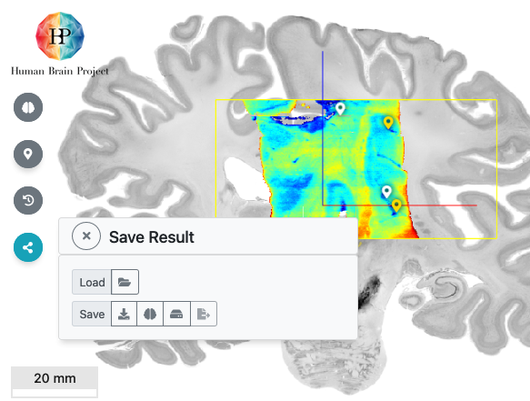

# Using the result

The result of aligning an input image dataset with a reference volume in VoluBA is the corresponding 4x4 transformation matrix. 
The matrix describes how a point in the coordinate system of the original input dataset should be transformed to match a corresponding point in the reference volume space.

!!! Info
	VoluBA has used the transformation to display the image volume in superimposition with the reference volume - it did not actually modify the input dataset.

The result can be used in a number of ways, which are all accessible via the *share/save result*  button on the left side of the user interface:

The options are:

 - Load your input dataset as an overlay in the EBRAINS Interactive Atlas Viewer, to see it in the comprehensive context of the brain atlas in BigBrain space.
 - Export the transformation parameters in a simple, plaintext *json* file for sharing and reuse
 - Store the transformation parameters in your private storage area of the [EBRAINS collaboratory drive](https://wiki.ebrains.eu/bin/view/Collabs/), from where VoluBA can recover your work automatically when you login again using your EBRAINS account. 
 - Submit your aligned dataset to EBRAINS data curation services for public sharing.

