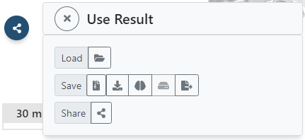

# Using the result

The result of aligning an input image dataset with a reference volume in voluba is the corresponding 4x4 transformation matrix. 
The matrix describes how a point in the coordinate system of the original input dataset should be transformed to match a corresponding point in the reference volume space.

!!! Info
	voluba has used the transformation to display the image volume in superimposition with the reference volume - it did not actually modify the input dataset.

The result can be used in several ways, which are all accessible via the **Share/Save transformation results**  button on the left side of the user interface:

- Export the affine transformation parameters in a simple, plaintext JSON file for sharing and reuse. The stored transformation file can be re-imported in voluba and be utilized in other tools and workflows.
- Load your input dataset as a semi-transparent overlay in the interactive atlas viewer siibra-explorer, to see it in the comprehensive context of the brain atlas in reference space. This way, you can investigate the aligned image volume relative to all the data that is registered with the corresponding reference atlas.
- Generate a private URL to view and share the anchored volume as a remote dataset in neuroglancer-based image viewers.