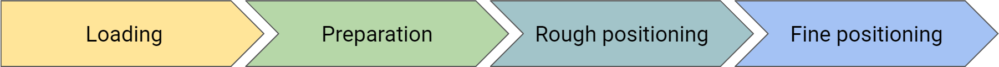

# Step-by-step tutorial

## Essential information
To anchor the volume as precisely as possible, some information is essential:

1. Resolution of the incoming volume
2. Hemisphere of extraction
3. Cytoarchitectonic area/region of extraction
4. Slicing direction of the incoming volume
5. Level of extraction

The more of the above information is available, the easier and more accurate the anchoring will be.

## Loading
Open the incoming volume.

dataset selection

> If you want to upload your own volume, you have to log in via HBP or ORCID. The file needs to be in NIfTI format (.nii or .nii.gz). After clicking "Upload" the volume should appear in the dropdown menu above. Select the dataset from the dropdown menu.

dataset search

> If you want to anchor a volume that is part of the [Knowledge Graph](https://search.kg.ebrains.eu/), search the dataset there to get as many information as possible. Filtering for _Homo sapiens_ is helpful.

## Preparation
Adjust the resolution and the appearance of the incoming volume.

resolution

> The resolution of the volume can be found in the **Data desciptor** of the [Knowledge Graph](https://search.kg.ebrains.eu/) or in the linked **Publication**. VoluBA assumes a resolution of 1 μm for the uploaded volume, so you have to scale the volume to it's actual resolution (e.g. if the actual resolution is 2 μm, scale it up by 2).

appearance

> Adjust the brightness, contrast, color map, etc. of the incoming volume via volume filters for better distinction between the displayed structures.

## Rough positioning
Drag and drop the incoming volume to its correspondig position in BigBrain.

hemisphere

> The hemisphere from which the volume originates can be found in the **Overview** or the **Data desciptor** of the [Knowledge Graph](https://search.kg.ebrains.eu/) or in the linked **Publication**.

cytoarchitectonic area/brain region

> The cytoarchitectonic area or brain region from which the volume originates can be found in the **Overview** or the **Data desciptor** of the [Knowledge Graph](https://search.kg.ebrains.eu/) or in the linked **Publication**.

slicing direction

> The slicing direction helps findig the right orientation of the incoming volume. This information can be found in the **Data desciptor** of the [Knowledge Graph](https://search.kg.ebrains.eu/) or in the linked **Publication**. You have to rotate the volume accordingly.

## Fine positioning
Refine the position of the incoming volume according to additional information.

brain of extraction

> If the incoming volume originates from the BigBrain, a perfect alignment can be achieved. If the incoming volume originates from a different brain, you have to take the individual variability or possible diseases into account, which can lead to deviations from the BigBrain. This information can be found in the **Data desciptor** of the [Knowledge Graph](https://search.kg.ebrains.eu/) or in the linked **Publication**.

level of extraction

> The level of extraction helps to narrow down the position of the incoming volume. For example, the position of a volume from the hippocampus can be constrained by knowing that it was extracted at the level of LGN (lateral geniculate nucleus). In the best case the position is given as a distance (in cm/mm/μm) to the reference structure. This information can be found in the **Data desciptor** of the [Knowledge Graph](https://search.kg.ebrains.eu/) or in the linked **Publication**.

type of content

> The type of the displayed content helps identifying significant structures. For example, the incoming volume can be tissue or a segmentation. If it is tissue, consider the staining method for structure identification (e.g. color channels in fluorescence microscopy). This information can be found in the **Data desciptor** of the [Knowledge Graph](https://search.kg.ebrains.eu/) or in the linked **Publication**.

significant structures

Significant structures help refining the orientation and position of the incoming volume. For example, the identification of laminae, sulci, gyri or other anatomical structures in the incoming volume give hints to the mentioned. This information may be found in the **Data desciptor** of the [Knowledge Graph](https://search.kg.ebrains.eu/) or in the linked **Publication**.

shape comparison

Comparing the shape of significant structures in the incoming volume to the correspondig structures in the BigBrain helps finding a matching position.

