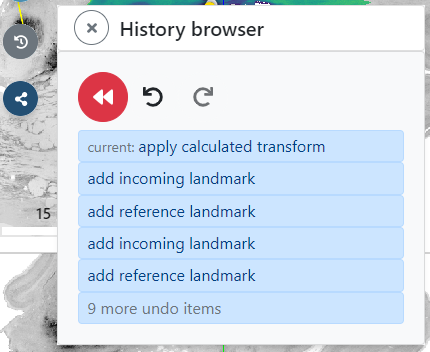

# Step-by-step tutorial

In this tutorial, you will anchor one of our public example datasets to BigBrain space. This means you can complete this tutorial without an EBRAINS or ORCID account.

!!! warning
    The purpose of this tutorial is not to achieve an anatomically correct alignment but rather demonstrate the general usage of voluba features.

## Loading input data

First, we select `BigBrain (2015)` as reference volume. The incoming volume is the public `Hippocampus` volume. Then, click `Start`.

## Filtering the input volume

The Hippocampus volume is now shown as a semi-transparent overlay on top of the BigBrain template. To get a better insight into the incoming volume, we will now adjust the presentation of the data. With the help of the **Volume filter** module on the top right, we apply filters to the image. Let's choose the following:

With this set of values the background is hidden and the hippocampal structures like DG, CA1, CA3 etc. are clearly visible.

## Transforming the input volume

In this section, we will transform the Hippocampus volume to a (more or less) anatomically reasonable position in BigBrain space. The given example tissue was extracted from the right hemisphere.

### Rough positioning

You can either perform all transformations with the **Transform incoming volume** dialog (brain icon on the left) or you can use your mouse for translation (Drag & Drop) and rotation (Shift & Drag).

The first thing that strikes is, that the coronal view of the incoming Hippocampus volume is displayed in the axial view of the BigBrain template (bottom left). To transform this plane to the BigBrain coronal view, we need to rotate the volume around the x-axis by 90°.

Next, we will roughly move the volume to the BigBrain Hippocampus by translating it. You will find, that the input Hippocampus is bigger in size than the BigBrain Hippocampus. So let's scale it down a bit. We also need to rotate the volume a bit more in x-direction to better match the reference in sagittal view (top right). Make sure, that the hippocampal structures approximately match in all views. Switching between different opacity values makes the comparison of incoming and reference volume easier.

### Fine positioning

The current anchoring result already looks reasonable. But we can make it even more precise. To refine the transformation matrix, we now enter pairs of landmarks. For selecting landmarks, the two pane mode is very useful. You can activate it by clicking the **mode** button on the top right. Now you will see the reference template on the left and the incoming volume on the right side.

Open the **Edit landmarks** dialog by clicking on the pin icon on the left. To add a landmark select the plus icon. You are now asked to add a landmark to the reference volume first. After that you can position a pin on the corresponding location in the incoming volume on the right. The more landmarks you add, the more accurate the recalculated transformation matrix will be. To start the calculation, select a transformation type and click the calculator icon. We choose `Affine` here.

By switching back to overlay mode, you can inspect the resulting alignment. If you are not satisfied with the result, you can always roll back to any state of the previous alignment steps by using the history browser. Open the browser by clicking the gray history icon on the left.

## Using the result

You can now for example download and reuse the parameters of the affine transformation matrix or view the anchoring result in the interactive atlas viewer siibra-explorer. Click on the **Use Result** and select the brain icon to open siibra-explorer.

## Essential information

As seen from the tutorial, there is some information that is essential to anchor the volume as precisely as possible. When aligning your own imaging data, the anchoring process is facilitated when the following details are known about your data:

* **Resolution of the incoming volume**  
_If you don't specify the voxel resolution in the NIfTI header of your incoming volume, you will need to set it manually in voluba._
* **Hemisphere and cytoarchitectonic area/region of extraction**  
_You will need this information to find a corresponding location in reference space._
* **Slicing direction of the incoming volume**  
_Based on the slicing direction you can derive how to rotate your volume to match the views in reference space (coronal, sagittal, axial)._
* **Level of extraction**  
_If your incoming volume is only a substructure of a brain region, more details about the location of extraction can help finding the corresponding position in reference space._

The more of the above information is available, the easier and more accurate the anchoring will be.