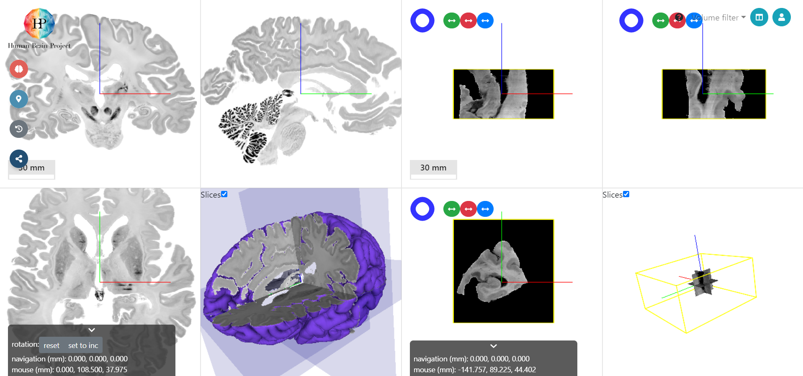

# Understanding the views

After the selection of a target space and an input volume, VoluBA starts in [overlay mode](#overlay-mode). The incoming volume is presented as a semi-transparent layer on top of the reference space in a 3D view with orthogonal cross-sections. The axes of the template space are color-coded with the x-axis being red, the y-axis being green and the z-axis being blue. This arrangement of axes becomes particularly important when aligning the volume, as the transformations are applied along these axes.

<table>
    <ttop>
        <tr>
            <th>coronal / xz-plane</th>
            <th>sagittal / yz-plane</th>
        </tr>
    </ttop>
    <ttop>
        <tr>
            <td colspan=2> &nbsp;</td>
        </tr>
    </ttop>
	<tbottom>
        <tr>
            <th>axial / xy-plane</th>
            <th>3D</th>
        </tr>
    </tbottom>
</table>

At any time, the view can be used in two different modes: the [overlay mode](#overlay-mode) and the [two pane mode](#two-pane-mode). All actions can be performed in both modes, although for some actions it is advisable to use a specific mode. You can switch between overlay and tow pane mode by clicking the **mode** button in the upper right part:

## Overlay mode

The default mode is overlay, which displays the input and reference volumes superimposed. Interactive shifting of the incoming volume is more easily performed in the overlay mode.

## Two pane mode

The second mode is two pane mode, which shows the two volumes in separate panels. Adding corresponding landmarks is typically more intuitive in this mode.

## Navigation

On the bottom left there is a navigation panel, which helps you orient yourself in space. Initially, the view is aligned with the incoming volume and the reference template. As soon as you rotate the input, the view stays aligned to the reference space and doesn't follow the VOI. If you prefer to align the view with the incoming volume, click `rotation: set to inc`. You can switch back to the original view with `rotation: reset`.

Underneath, you can find the current physical positions in target space. All coordinates are given in the order x, y, z. `navigation (mm)` tells you the physical position (in mm) of the axes origin. Accordingly, `mouse (mm)` is the physical position (in mm) of your mouse pointer.

!!!info
    If there is a specific **BigBrain** slice, that you want to navigate to, the following equation helps you find the physical position in mm:
    $$\text{position} = -70 + (\text{slice}-1) * 0.02$$