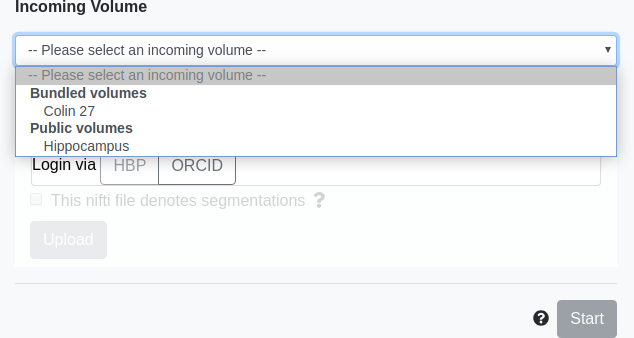

# Select incoming volume

You will need to select an incoming volume either from public volumes (if not logged in)

or private volumes (if logged in)

Upon selection, the volume will begin loading, and overlayed on top of the reference template.

<!-- need loading image? -->

click `Start` to proceed to the next step.